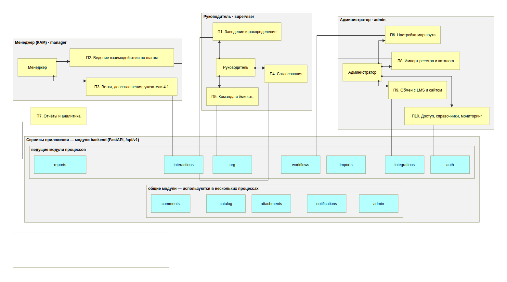
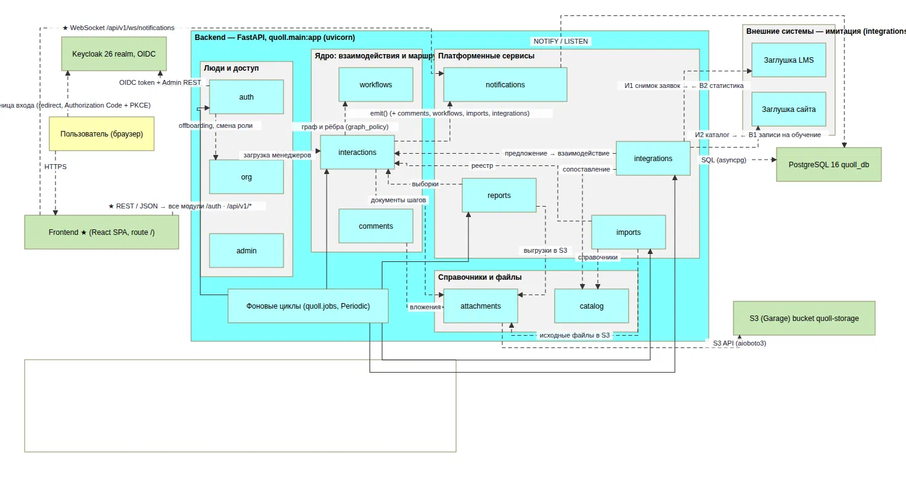
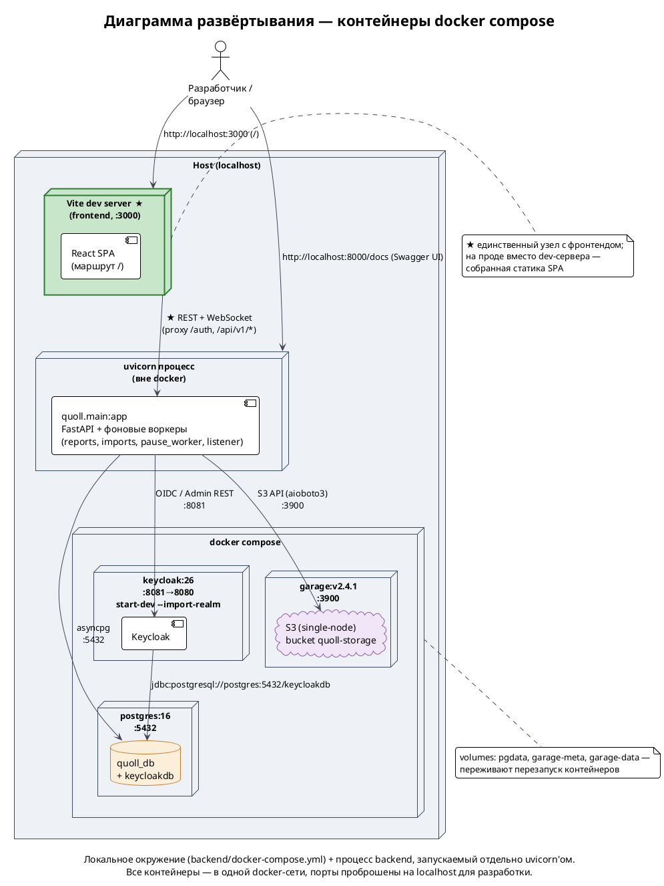

# Архитектура

## Функциональная архитектура

Система делится на шесть функциональных блоков:

1. **Идентификация и доступ (auth).** Вход через Keycloak, сессии, три роли, деактивация, смена роли и увольнение как отложенные оргзадачи, аудит.
2. **Оргструктура и загрузка (org).** Команды руководителей, три пула менеджеров (свободные, для назначения, осиротевшие), перевод и открепление, лимиты и ёмкость.
3. **Заявки (interactions + workflows).** Воркфлоу как граф этапов и переходов. Заявка проходит по нему: черновик, назначение, принятие, переходы, пауза, закрытие, откат, переоткрытие. К этому же относятся поля этапов, документы, просьбы, и ветки, импорт.
4. **Справочные данные (catalog).** Вузы, вендоры, направления, продукты, программы, специальности, виды документов, причины закрытия, контакты.
5. **Файлы (приложения).** Шаблоны для переходов и документы заявок в S3.
6. **Коммуникации и надзор (notifications, admin).** Лента уведомлений с WebSocket, сводка здоровья системы.

*Рисунок 8.1. Функциональная архитектура в нотации ArchiMate. Исходный файл: docs/diagrams/01-functional.archimate в репозитории.*

## Компонентная архитектура

• Внутри каждого модуля повторяется одна схема: router → service → repository → models, а правила доступа вынесены в *_policy.py (access_policy, capacity_policy, step_policy, graph_policy).
• Общее лежит в core (базовый репозиторий, исключения, блокировки строк) и в db.
• Фоновые задачи описаны в jobs.py и запускаются вместе с приложением: сверка с Keycloak, очередь оргзадач, чистка сессий, снятие пауз.

*Рисунок 8.2. Компонентная архитектура: модули приложения, связи между ними и с внешними сервисами (Keycloak, PostgreSQL, S3, заглушки LMS и сайта). Исходный файл лежит в репозитории в docs/diagrams/.*

## Модульный монолит

Мы выбрали модульный монолит, так как он требует меньше инфраструктуры, также проще отладка, а разработка такого не слишком большого и высоконагруженного проекта становится эффективнее.

## Схема развёртывания

*Рисунок 8.3. Локальное окружение: PostgreSQL, Keycloak и Garage S3 в docker compose, рядом процесс приложения. Порядок запуска описан в разделе 15.*

## Ключевые сценарии

Как модули работают вместе, показано на диаграммах последовательностей в Приложении Г:

- **Г.1** Переход с одобрением руководителя (3 -> 4) и отказ (-> 3.1), разделы 4.3, 4.4;
- **Г.2** Подписание договора и открытие веток, одобрение допсоглашения, раздел 4.4;
- **Г.3** Передача заявки другому КАМу, раздел 3.3;
- **Г.4** Обмен с LMS: вуз без заявки -> предложение создать заявку, разделы 4.1, 7.1.
