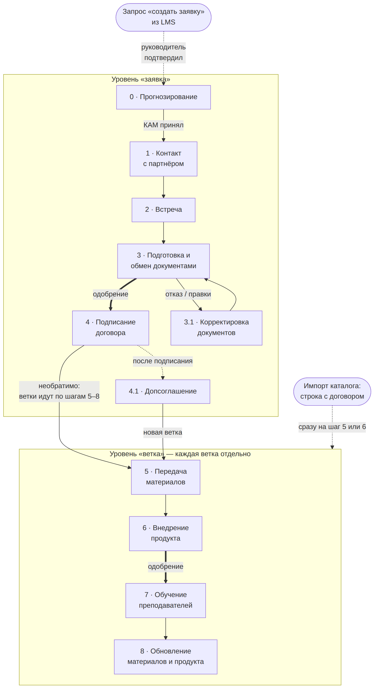

# Workflow

## Единица работы

• Заявка - это работа с одним вузом по одному договору. У вуза не больше одной незакрытой заявки.
• До подписания заявка целиком идёт по шагам 1–4, а её ветки имеют черновой состав: программы и продукты можно свободно добавлять и убирать. После подписания договора каждая веточка идёт по шагам 5–8 отдельно; ветка = одна программа + не больше одного продукта.
• Три входа в workflow:
  – руководитель создаёт заявку на шаге 0;
  – запрос «создать заявку» из LMS для вуза без заявки: руководитель, подтвердив его, становится автором заявки, выбирает продукты и назначает КАМа, программа уже подставлена.
  – импорт каталога из 10 полей ТЗ: строка без номера договора создаёт заявку и назначает её КАМу из колонки «ФИО Менеджера»; строка с номером договора создает подписанную заявку с веткой на шаге 6, если передача сделана, если нет - на шаге 5. Несколько строк одного вуза - одна заявка с несколькими ветками.
• Работа по шагам начинается, когда КАМ примет заявку. Если КАМ отказался, заявка ждёт нового ответственного, а его назначает руководитель. Исключение — подписанная заявка из импорта: её ветки сразу на шаге 5 или 6.

## Схема маршрута

Жирная стрелка означает переход с одобрением руководителя; пунктир - это необязательный вход. Шаг 4.1 идёт параллельно веткам. С возвратами и закрытием вы можете ознакомиться в разделе Механики.

## Шаги

| Шаг | Шаг из ТЗ | Что делает человек | Что делает система | Файлы и одобрение |
| --- | --- | --- | --- | --- |
| 0 «Прогнозирова ние» | — | Руководитель выбирает вуз, программы и продукты, назначает КАМа | Подсказка: программы по специальностям вуза, ни на что не влияет; уведомляет КАМа | Файлов нет |
| 1 «Контакт с партнёром» | 1–2 | КАМ связывается с вузом вне системы, пишет итог в комментарий | Контакты вуза уже в карточке - передаются из справочника вузов | — |
| 2 «Встреча» | 3 | КАМ вносит дату встречи, после встречи - итог в комментарий | Хранит дату; напоминаний нет | По желанию: протокол, презентация |
| 3 «Подготовка и обмен документами» | 4 | КАМ обменивается пакетом с вузом, прикладывает его, запрашивает переход | Отправляет руководителю запрос на одобрение | Обязателен пакет документов обмена; переход из 3 в 4 - с одобрением руководителя |
| 3.1 «Корректировк а документов» | 5 | КАМ правит пакет и возвращает заявку на шаг 3 | Сюда заявка попадает при отказе руководителя или по решению КАМа | Шаг необязательный; одобрение из 3 в 4 нужно снова |
| 4 «Подписание договора» | 6 | КАМ прикладывает скан подписанного договора, вносит номер | Фиксирует состав, ставит ветки на шаг 5 | Обязательны скан и номер; дата - по желанию. Переход назад при выполнении шага необратим. |
| 4.1 «Допсоглашен ие» | — | КАМ вносит номер, дату, скан и действия | После одобрения применяет действия (см. 4.4) | Номер, дата, скан; нужно одобрение руководителя |
| 5 «Передача материалов» | 7 | КАМ вносит дату подписания лицензии и её срок | Ставит статус передачи; считает «лицензия действует до» | Обязателен акт приёма-передачи; у ветки без продукта лицензии нет |
| 6 «Внедрение продукта» | 8 | КАМ подтверждает, что продукт работает; у ветки без продукта нужен комментарий «продукта нет» | При отказе в одобрении ветка остаётся на шаге 6 с комментарием руководителя | По желанию: подтверждение внедрения; из 6 в 7 переход с одобрением, у ветки без продукта тоже |
| 7 «Обучение преподавателе й» | 9–10 | КАМ вносит число обученных преподавателей, прикладывает рабочую программу | Показывает рядом число обученных по данным LMS | По желанию: списки обученных, сертификаты, рабочая программа |
| 8 «Обновление материалов и продукта» | 12–13 | КАМ периодически пишет отчёт о ходе внедрения: что обновилось и обучены ли преподаватели; если нужно переобучение он возвращает ветку на шаг 7 | Хранит новые версии, старые не удаляет | По желанию: отчёт, новые материалы |
| Без шага | 11 | Никто: занятия ведёт вуз | Фоном получает из LMS число студентов и потоков - одно на пару «вуз × программа»; если нет ветки, значит запрос руководителю | — |
| Без шага | 14 | — | Застой (см. 4.4), история заявки, запросы на решение. Уведомления в интерфейсе: застой, окончание лицензии, договора и паузы, запрос на одобрение и решение по нему, назначение заявки | — |

## Механики

**Ветки.** Программа с двумя продуктами - две ветки, без продукта - одна. У каждой ветки свои шаг, лицензия, пауза, застой и закрытие; ответственный КАМ только один на заявку. До подписания состав заявки меняется свободно, но после подписания договора - только допсоглашением.

**Допсоглашение (шаг 4.1).** Одно за раз; ветки тем временем работают, их застой не сбрасывается. После одобрения руководителем: новые ветки открываются на шаге 5; продление лицензии обновляет срок ветки; продление договора обновляет срок договора; возобновление возвращает закрытую ветку на её шаг закрытия; удаление ветки (до старта шага 7) закрывает её.

**Возврат на шаг назад.** До подписания: КАМ возвращает на 1 шаг назад, руководитель на любой шаг. После подписания внутри веток: КАМ на 1 шаг назад, но из 8 в 6 (минуя 7), если изменения программы требуют перевнедрения; из 8 в 7 обычный возврат на шаг. После подписания к шагам 1–4 не вернуться: договор меняют только допсоглашением.

**Правка пройденного шага и комментарии.** Комментарий добавляется свободно; при возврате, паузе и закрытии он обязателен. Новый файл или данные шага только через одобрение руководителя. Мессенджер частично реализуется через комментарии на каждом шаге заявки: переписка по конкретному вузу и конкретной заявке идёт там.

**Пауза.** Может ставиться на всю заявку или на одну ветку, с комментарием и необязательным сроком; застой на паузе не считается. По окончании срока пауза снимается сама. У заявки, если у КАМа нет свободного места в лимите, пауза ждёт, пока место появится, на паузе заявка в лимит проектов, которые можно вести одновременно, не входит. По окончании паузы приходит уведомление о том, что она закончилась.

**Закрытие и переоткрытие.** КАМ запрашивает закрытие заявки или ветки с причиной из справочника, руководитель подтверждает. Закрытие последней ветки заявку автоматически не закрывает - руководитель получает предложение закрыть или переоткрыть в зависимости от того, как дальше идет сотрудничество с вузом. Руководитель может переоткрыть закрытую заявку - он выбирает КАМа и шаг, на котором заявка уже была, после подписания договора и не раньше шага 4; отсчёт застоя начинается заново. Закрытую ветку возвращает допсоглашение. Удалить можно только неподписанную заявку, которая ни разу не стояла на шаге.

**Застой.** Заявка или ветка в застое, если с начала отсчёта прошло больше дней, чем порог (дни календарные). Общий порог стоит по умолчанию 14 дней, общий порог меняет администратор, а руководитель может задать свой порог для заявки. Отсчёт застоя начинается заново при переходе, возврате, снятии паузы и переоткрытии. Уведомление получают руководитель и КАМ - одно, без повторов и на любом шаге

**Версии документов.** Новая версия не заменяет старую: прежняя остаётся на шаге и сереет. Администратор удаляет только ошибочно прикреплённый файл, с записью этого в журнал действий.

## Изменение маршрута

• Маршрут B2B один на все вузы, версий нет: заявка хранит ссылку на шаг, а не копию маршрута. Новый маршрут собирается черновиком и публикуется; правки опубликованного сразу действуют на все заявки. На каждый тип клиента должен быть один опубликованный маршрут: для вузов это B2B, второй для B2C.
• Руководитель предлагает изменение запросом, администратор одобряет или отклоняет и вносит правку в редакторе.
• Переименовать шаг или отправить его в архив может только администратор, после подтверждения в диалоговом окне. Шаг при этом не удаляется: заявки и ветки с него переносятся на предыдущий активный шаг того же уровня или на шаг, выбранный администратором.
• Перед публикацией и после каждой правки система проверяет схему (все шаги достижимы, необратимый переход один и др.); сломанная схема не сохраняется. С подробностями можно ознакомиться в разделе 17.

## Второй маршрут (B2C)

В прототипе администратор создаёт второй маршрут в том же редакторе: свои шаги и переходы, та же проверка схемы. Этот маршрут для B2C: заявки вузов ведутся по маршруту B2B. Выбор маршрута при создании заявки реализован через заглушку; ведение по второму маршруту заявок клиентов-физлиц описано в разделе 14.
