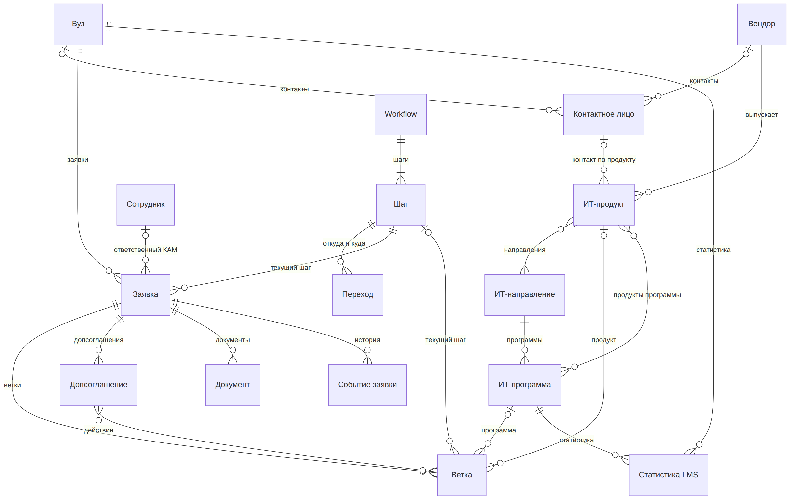

# Модель данных

## Принципы

• Каталоги хранятся в БД; администратор загружает их из xls/xlsx по маппингу колонок, с предпросмотром.
• Заявка хранит ссылку на шаг, а не копию маршрута, - версий маршрута нет.
• История не удаляется: шаги уходят в архив, заявки и ветки закрываются, документы получают новые версии. Исключения: неподписанную заявку, которая ни разу не стояла на шаге, можно отменить (раздел 4.4); ошибочно прикреплённый файл удаляет администратор с записью в журнал действий.
• Вуз уникален по «ИНН + КПП», а не по названию: повторная загрузка справочника вузов не плодит дублей, филиал со своим договором является в нашей системе отдельным вузом.
• Персональных данных должно быть минимум; ФИО, телефон и email контактов шифруются.

## Схема

Не показаны: запрос на решение, данные шага, специальность, сопоставление курса, запись на обучение с сайта, журнал действий, справочники видов документов и причин закрытия.

## Сущности

| Сущность | Зачем | Ключевые поля | Главное правило |
| --- | --- | --- | --- |
| Каталоги |  |  |  |
| Вуз | Сторона договора | название (полное, краткое), ИНН, КПП, регион, город | Уникален по «ИНН + КПП» |
| Контактное лицо | Люди вуза и вендора | владелец, ФИО, телефон, email, актуален | Владелец - вуз или вендор; ФИО, телефон, email зашифрованы |
| Вендор | Поставщик продукта | название | У продуктов Ростелекома - «ПАО «Ростелеком»» |
| ИТ- направление | Область обучения | название | Крупные категории edu-rt, мельче не дробим |
| ИТ-программа | Методические материалы, они её ранжируют | название, направление, продукты, ручной приоритет, ID курса на сайте и в LMS | самая востребованная выявляется по приоритету 1 |
| ИТ-продукт | ПО для обучения | название, вендор, направления, контакт вендора, активен | Неактивный не попадает в новые ветки |
| Специальность | Подсказка руководителю на шаге 0 | код ОКСО, название, уровень, теги навыков | На заявку не влияет |
| Сотрудники |  |  |  |
| Сотрудник | КАМ, руководитель, администратор | роль, ID в Keycloak, ФИО, рабочий email; у КАМа это руководитель, лимит заявок и статус доступности; у руководителя это лимит команды | ФИО не шифруется: служебные данные |
| Маршрут |  |  |  |
| Workflow | Маршрут, для вузов он один - B2B | название, опубликован | Правки опубликованного сразу действуют на все заявки; B2C описан в разделе 14 |
| Шаг | Шаг маршрута | название, порядок, уровень (заявка / ветка), поля шага, в архиве | Удалённый шаг уходит в архив |
| Переход | Разрешённый путь между шагами | откуда и куда, возврат, нужно одобрение, шаг при отказе, нужные документы | Двигаться можно только по переходам |
| Работа с вузом |  |  |  |
| Заявка | Работа с вузом по договору; шаги с 1 по 4 | вуз, ответственный КАМ, текущий шаг, состояние, текущее допсоглашение | У вуза может быть только одна незакрытая заявка |
| Ветка | Программа и продукт в договоре; шаги 5–8 | программа, продукт, текущий шаг, лицензия, статус по передаче | Свои шаг, лицензия, пауза и закрытие |
| Допсоглашение | Изменение договора, шаг 4.1 | номер, дата, скан, статус, действия | может быть только одно неодобренное. Начинает действовать после одобрения |
| Документ | Файл на шаге | вид, файл, ключ в хранилище, предыдущая версия, номер договора | Старые версии не удаляются |
| Событие заявки | История заявки и веток | тип (переход, возврат, комментарий, пауза и снятие, закрытие, переоткрытие, старт и возобновление ветки, ветка добавлена или убрана, допсоглашение открыто, одобрено, отклонено или отменено, продление, перенос, импорт), с шага на шаг, комментарий, автор, время | По событиям считается статус на конец периода |
| Запрос на решение | Ждёт решения руководителя | тип, заявка или ветка, кто запросил, статус, кто решил | Запрос из LMS может быть без заявки |
| Данные шага | Поля, настроенные на шаге | заявка, ветка, шаг, значения полей | Правка пройденного шага только с одобрения |
| Интеграции |  |  |  |
| Статистика LMS | Данные обучения из LMS | вуз, программа, студенты, потоки, обучено преподавателей | Если нет ветки значит запрос руководителю |
| Сопоставление курса | Актуализация программы | курс у источника, программа, статус записи | Администратор сопоставляет только ключи |
| Запись на обучение с сайта | Запись человека на курс | номер заказа, программа, поток, дата, отпечаток email | ФИО, телефон и email не хранятся |

• Журнал действий видит только администратор; ФИО, телефон и email сотрудников и контактов в журнал не пишутся.
• Ключи обмена: LMS получает внутренние ID вуза и программы; запасные ключи - «ИНН + КПП» и ID курса.
• В прототипе есть всё из таблицы. Обучающиеся и логика B2C - этап 2, раздел 14.

## Главные правила связей

1. Одна заявка = один договор. У вуза может быть только одна незакрытая заявка, поэтому одновременно действует один договор. Изменения после подписания договора может происходить только допсоглашением.
2. У вуза не может быть больше одной незакрытой заявки.
3. Ветка = одна программа + не больше одного продукта этой программы.
4. У продукта ровно один вендор и минимум одно направление.
5. Программа это ровно одно направление, продукт необязателен; направление ветки берётся из программы.
6. Статистика LMS это одна запись на пару «вуз × программа», общая для всех её веток.

## 10 полей каталога ТЗ

Строка каталога это пара «вуз × продукт», поэтому импорт раскладывает её по нескольким сущностям.

Лицензия и передача это явные поля ветки, а не данные шага: поле шага можно переименовать, и если бы они были данными - сломались бы отчёты, импорт и JSON.

Программы среди 10 полей нет, у импортированной ветки она пуста до уточнения.

Импорт. Вуз, вендор и продукт должны уже быть в справочниках, а строка находит их по названию. Строка без договора создаёт заявку для КАМа, с договором - создает подписанную заявку с веткой на шаге 5 или 6 (раздел 4.1). Два номера договора у одного вуза - это ошибка. Повторный импорт договорные данные не перезаписывает.

| Поле ТЗ | Где хранится | Почему |
| --- | --- | --- |
| Название ВУЗа | Вуз | Ссылка на каталог вместо текста без разнобоя в отчётах |
| Вендор | Вендор, через продукт | Свойство продукта: в одном договоре бывают разные вендоры |
| ПО | ИТ-продукт, с вузом - через ветку | Продукт общий для всех вузов |
| Номер договора | Документ вида «договор» | У заявки один договор, продукты входят в него |
| Подписание лицензии | Ветка: дата | Лицензия у каждой ветки своя |
| Срок действия лицензии (год) | Ветка: число лет | Сроки внутри договора разные, продлеваются допсоглашением |
| Статус по передаче | Ветка: «Передано» / «Не передано» | Передача идёт по каждой ветке отдельно |
| ФИО Менеджера | Сотрудник - ответственный КАМ заявки | От него зависят права и фильтры |
| Ответственные от ВУЗа | Контактное лицо вуза | Их может быть несколько, это ПДн |
| Комментарий | Событие «комментарий» у ветки | Все комментарии в истории, с автором и датой |

## Файлы

• Файлы хранятся в S3 отдельно от БД; в БД, а описание файла и ключ в хранилище.
• Новая версия не заменяет старую: прежняя остаётся со статусом «устарел».
• Форматы: png, jpeg, pdf, zip, gzip, rar, doc, docx, xls, xlsx и pptx для презентаций.
• С физическими схемами базы данных можно ознакомиться в Приложении 1
